# Todo List Flutter App

## Description
This Flutter app is a simple todo list manager designed to help users keep track of their tasks and manage their daily activities efficiently.

## Features
- **Add Category**: Tasks can be categorized into different categories for better organization.
- **Delete Category**: Users can delete categories by long-pressing and dragging them.
- **Add Task**: Users can add new tasks to the list by entering task details and submitting.
- **Edit Task**: Users can edit task details such as title, description, due date, etc.
- **Delete Task**: Users can remove tasks from the list when they are completed or no longer needed.
- **Mark as Completed**: Users can mark tasks as completed to keep track of their progress.

## Screenshots
**1. Category**

    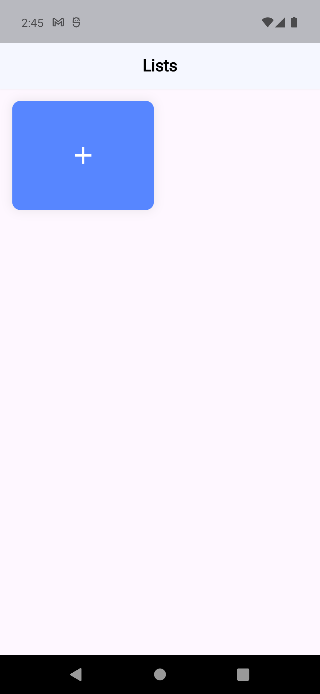
    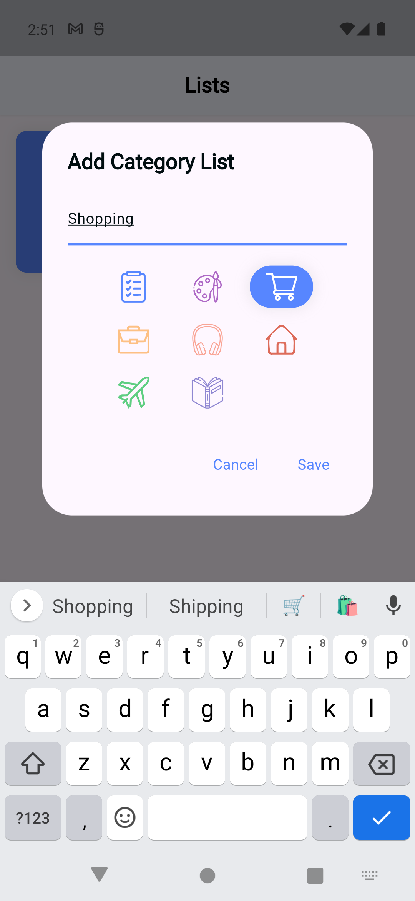
    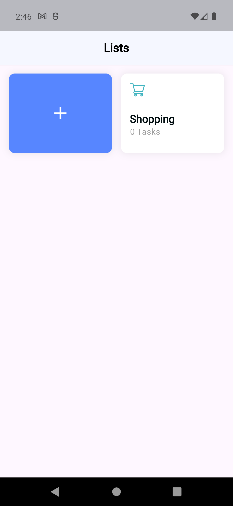

 

**2. Add Task Todo**

    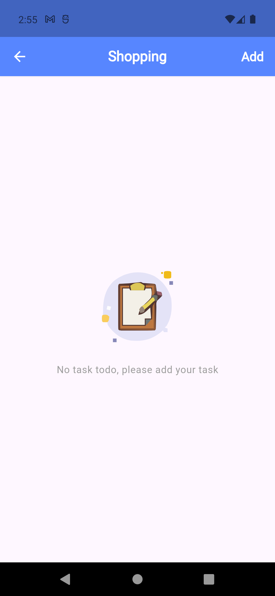
    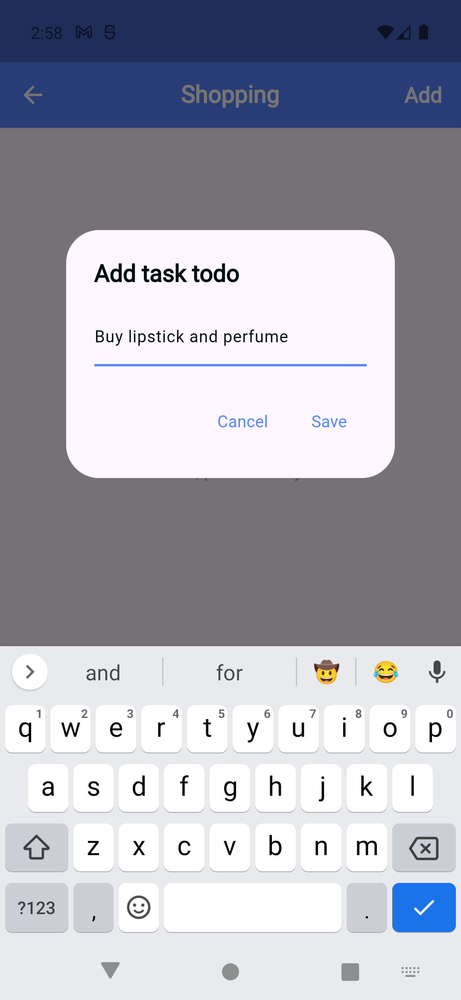
    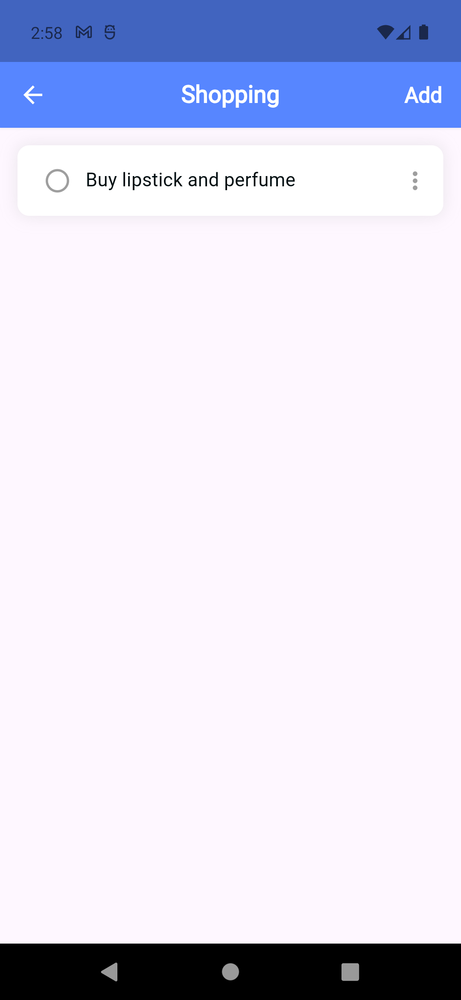

 

**3. Edit Task Todo**

    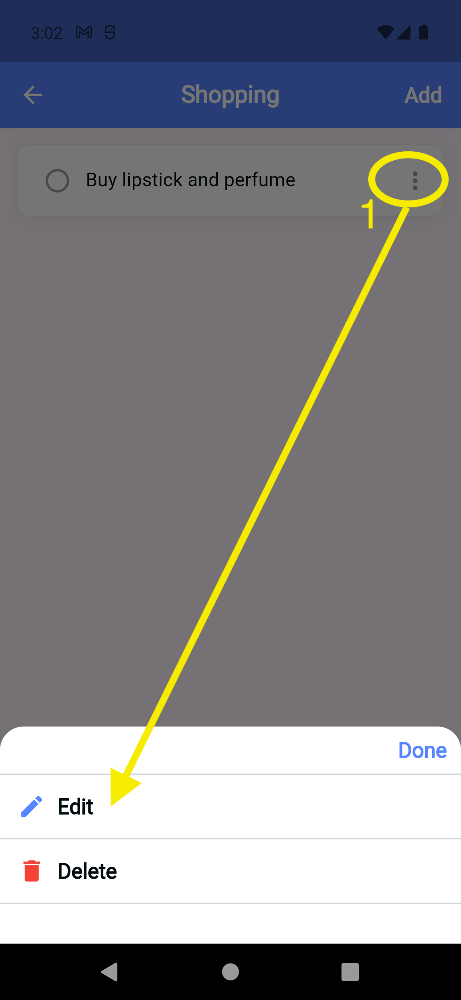
    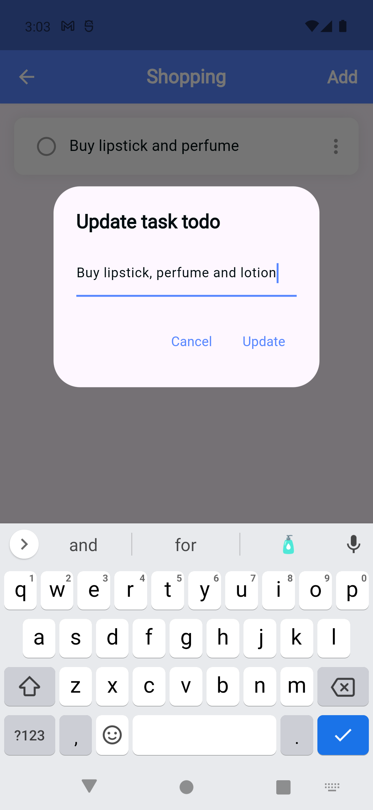
    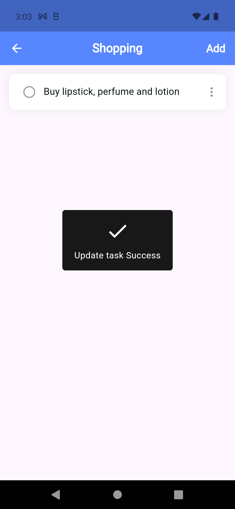

 

**4. Delete Task Todo**

    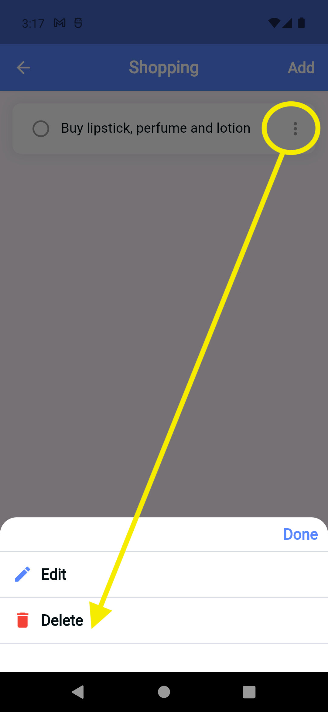
    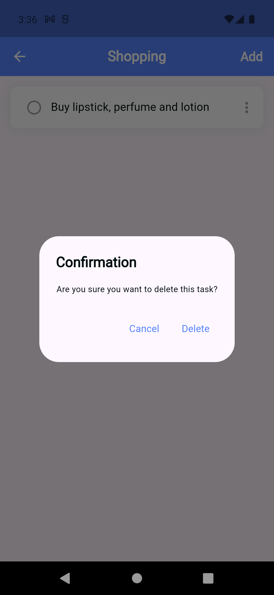
    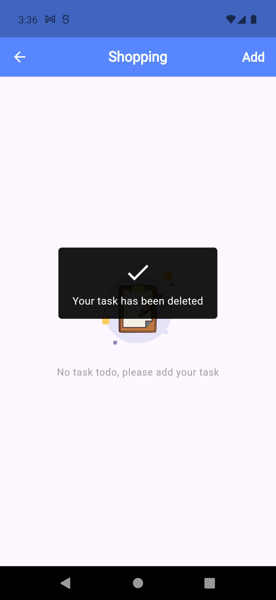

 

**5. Mark as Completed**

    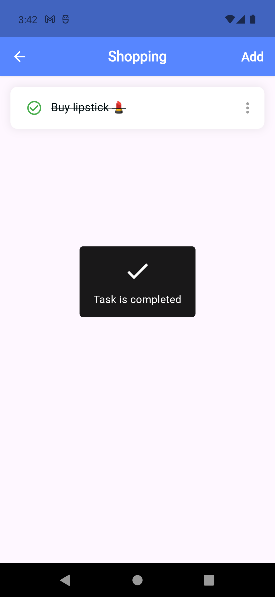

## Continuous Integration (CI) Server
This Todo App is use [[Codemagic](https://blog.codemagic.io/getting-started-with-codemagic/)] to deploy App to a continuous integration (CI) server. 
    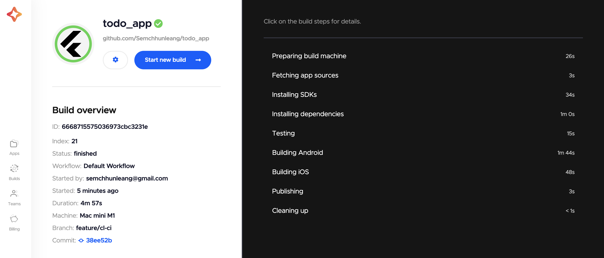

## Installation
1. Clone the repository from [[GitHub link](https://github.com/Semchhunleang/todo_app)].
2. Navigate to the project directory.
3. Run `flutter pub get` to install dependencies.
4. Connect your device/emulator.
5. Run `flutter run` to launch the app.

## Contributors
- [Sem Chhunleang] ([link to your GitHub profile](https://github.com/Semchhunleang/todo_app))

## License
This project is licensed under the Sem Chhunleang.
